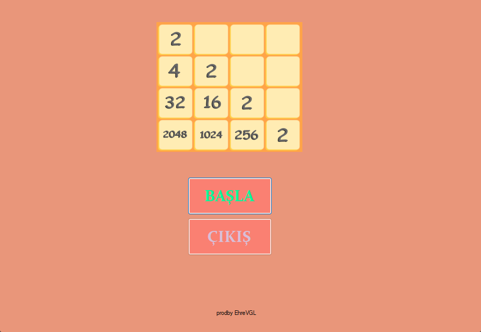
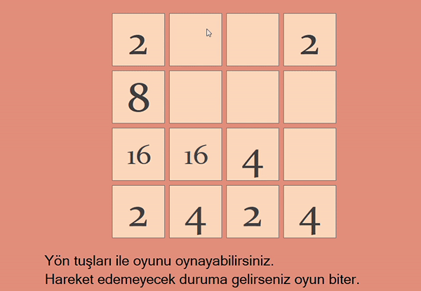

# 2048 - C# Windows App Uygulaması

## Herkese Selamlar

Bu proje, C#'a başladığım zaman yapmış olduğum ilk projelerden birisi. 
Bu projeyi yapmamdaki amaç; C# dilini öğrenmeye yeni başlamış birisi olarak, 'Windows App' uygulaması yaparken nelerle karşılaşabileceğimi kolay bir uygulama ile görmekti.

Klavye inputlarını kullanarak nesneleri hareket ettirebileceğim ve farklı algoritmalar kullanarak oynayabileceğim bir oyun tasarlamak istemiştim. Sonucunda böyle bir uygulama ortaya çıktı.

## İçindekiler

0. [Herkese Selamlar](#herkese-selamlar)
1. [Uygulama Hakkında](#uygulama-hakkında)
2. [Youtube Linki](#youtube-linki)

## Uygulama Hakkında

Oyun, uygulamanın **BAŞLA** butonuna tıklandığı zaman başlar. Yön tuşları ile bloklar hareket ettirilir ve hareket edilemeyecek duruma geldiği zaman oyun biter.

Oynanış hakkında kısa bir görüntü:

## Youtube Linki

Youtube üzerinden paylaştığım uygulama videosuna [bu linkten](https://youtu.be/DCNAg441QK0) ulaşabilirsiniz.
